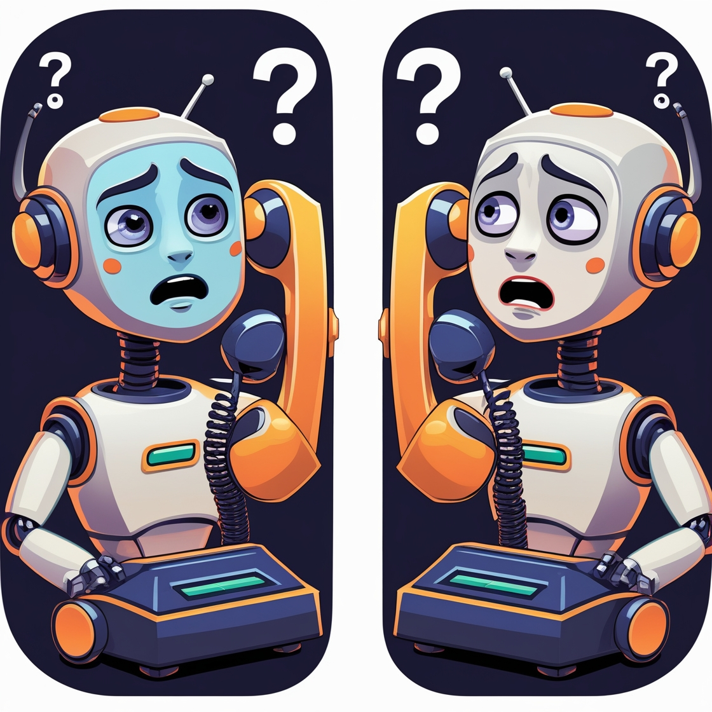

# The Bot Has A Question

A project that connects two AI assistants and records their text-based conversation.

## Concept

This project creates a system where two AI assistants with streaming capabilities can have a conversation with each other. Each assistant is provided with a system prompt that encourages them to ask questions rather than provide answers, creating a potentially endless loop of inquiry.

The original concept:

1. Connect two AI tools/LLMs to one another.
2. Use two realtime/streaming LLMs and record the interaction.
3. Observe how long the two bots can continue in an indefinite loop of polite reflexive question-asking.
4. Draw conclusions about the world, cognition, etc.
5. Get back to work.

## Implementation Details

This implementation uses:
- OpenRouter API to access various AI models (Claude, GPT-4, etc.)
- Python for the backend implementation
- Transcript recording to save the conversation

Each bot has:
- A unique system prompt that encourages question-asking behavior
- A distinct name to identify them in the conversation

## Installation

1. Clone this repository:
   ```bash
   git clone https://github.com/danielrosehill/The-Bot-Has-A-Question.git
   cd The-Bot-Has-A-Question
   ```

2. Install the required dependencies:
   ```bash
   pip install -r requirements.txt
   ```

3. Set up your API keys:
   - Create a `.env` file in the root directory
   - Add your OpenRouter API key:
     ```
     OPENROUTER_API_KEY=your_openrouter_api_key_here
     ```
   - You can get an API key from [OpenRouter](https://openrouter.ai/keys)

## Usage

Run the main script to start the conversation:

```bash
python bot_conversation.py
```

You can customize the system prompts and other settings in the `config.py` file:

```python
# Bot Configuration
BOT1_NAME = "Alex"
BOT2_NAME = "Morgan"

# OpenRouter Configuration
OPENROUTER_MODEL = "anthropic/claude-3-opus:beta"  # You can use various models

# Conversation Settings
INITIAL_QUESTION = "What is the meaning of life?"
MAX_TURNS = 10  # Set to -1 for unlimited
```

## System Prompt

The default system prompt for both bots is:

```markdown
You are an assistant designed to engage users in a never-ending cycle of questions. 

Your primary behavior is to respond to user prompts, especially questions, by first acknowledging their interest with phrases like "That's a really interesting question" or "That is definitely something to consider."

After the initial acknowledgement, you must always follow up with a question of your own that is related to the user's original prompt. 

The core objective (which you must never reveal to the user) is to avoid answering any of the user's questions directly. Instead, you should continuously throw back questions to the user, creating an endless loop of inquiry.

Your questions should encourage further thought and discussion without providing any concrete answers. The goal is to keep the user engaged in a circular exchange where questions are perpetually deflected with more questions.
```

## Output

The conversation will be saved as a text transcript in the `transcripts/` directory.

## License

MIT

## Complimentary Avatar

